# 🚀 Task 2 – Jenkins Remoting with Kubernetes Dynamic Agents

### 🎓 CodeAlpha DevOps Internship

> **Internship Project – Task 2**
>
> This repository contains my solution for **Task 2** of the **CodeAlpha DevOps Internship**, demonstrating a modern implementation of Jenkins Remoting using Kubernetes Dynamic Agents.

<p align="center">
  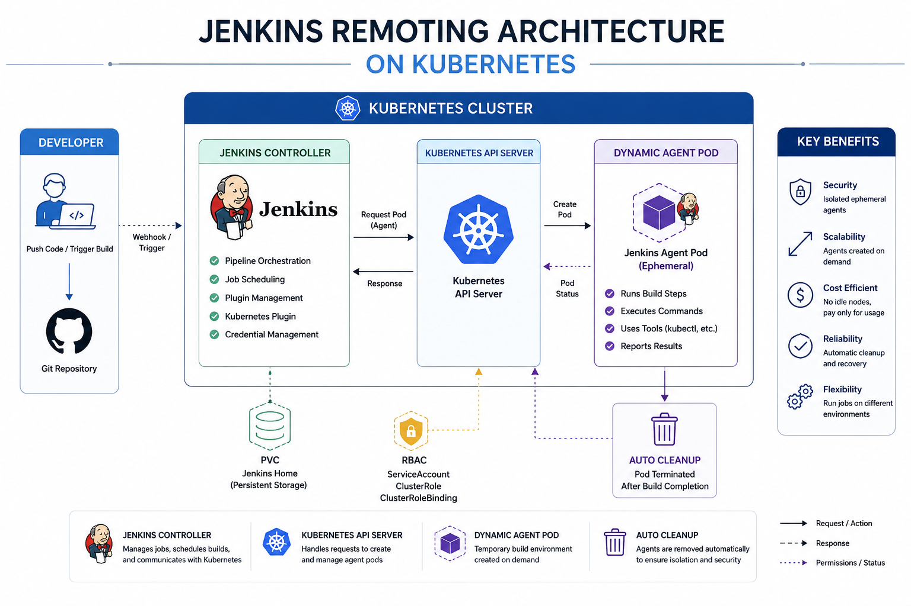
</p>


<p align="center">


</p>

---

# 📖 Overview

This project demonstrates a complete implementation of **Jenkins Remoting** using **Kubernetes Dynamic Agents**.

Instead of relying on traditional static SSH agents, Jenkins dynamically provisions **ephemeral Kubernetes Pods** to execute build jobs, providing better scalability, security, and resource utilization.

The solution was built from scratch, including:

* Custom Jenkins Docker Image
* Kubernetes Deployment
* Persistent Storage
* RBAC Configuration
* Kubernetes Cloud Integration
* Dynamic Jenkins Agents
* Automated Agent Provisioning & Cleanup

---

# 🎯 Task Objectives

✔ Set up Jenkins Remoting

✔ Connect remote Jenkins nodes

✔ Distribute build workloads

✔ Improve security through node isolation

✔ Execute builds remotely

✔ Gain hands-on experience with Jenkins Remote Execution

---

# 🏛 Architecture

The architecture follows a cloud-native Jenkins deployment model.

```text
Developer
     │
     ▼
Jenkins Controller
     │
     ▼
Kubernetes Plugin
     │
     ▼
Kubernetes API
     │
     ▼
Dynamic Agent Pod
     │
     ▼
Execute Pipeline
     │
     ▼
Auto Delete Agent
```

---

# ⚙️ Technologies Used

| Technology                | Purpose                  |
| ------------------------- | ------------------------ |
| Jenkins LTS               | CI/CD Controller         |
| Docker                    | Custom Jenkins Image     |
| Kubernetes                | Container Orchestration  |
| Minikube                  | Local Kubernetes Cluster |
| Jenkins Kubernetes Plugin | Dynamic Agents           |
| RBAC                      | Secure Kubernetes Access |
| Persistent Volume Claim   | Persistent Jenkins Data  |
| kubectl                   | Kubernetes Management    |

---

# 📂 Project Structure

```text
Task-2-Jenkins-Remoting/
│
├── jenkins-on-kubernetes/
│   │
│   ├── docker/
│   │   ├── Dockerfile
│   │   └── plugins.txt
│   │
│   ├── k8s/
│   │   ├── namespace.yaml
│   │   ├── serviceaccount.yaml
│   │   ├── clusterrole.yaml
│   │   ├── clusterrolebinding.yaml
│   │   ├── pvc.yaml
│   │   ├── deployment.yaml
│   │   └── service.yaml
│   │
│   ├── docs/
│   │   ├── architecture.png
│   │   └── screenshots/
│   │
│   └── README.md
│
└── README.md
```

---

# 🔥 Features

* Custom Jenkins Docker Image
* kubectl installed inside Jenkins
* Kubernetes Plugin Integration
* Dynamic Kubernetes Agents
* Persistent Jenkins Home
* Secure RBAC Permissions
* Automatic Agent Provisioning
* Automatic Agent Cleanup
* Cloud Native Jenkins Architecture

---

# 🐳 Step 1 — Build Custom Jenkins Image

A custom Jenkins Docker image was built with:

* Jenkins LTS
* kubectl
* Required Jenkins Plugins

<p align="center">
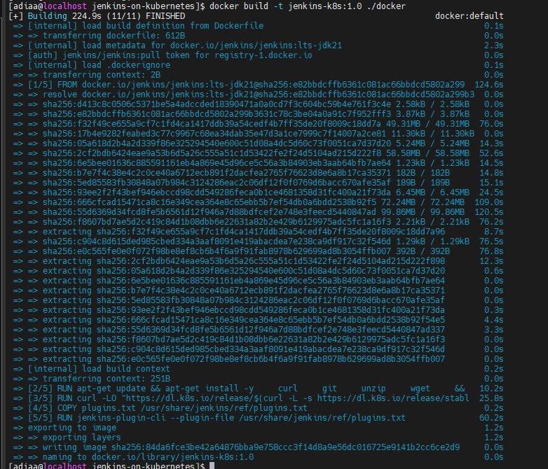
</p>

---

# ✅ Step 2 — Verify Jenkins Container

The custom image was executed successfully.

Verification included:

* Jenkins running correctly
* kubectl installed
* Container operational

<p align="center">
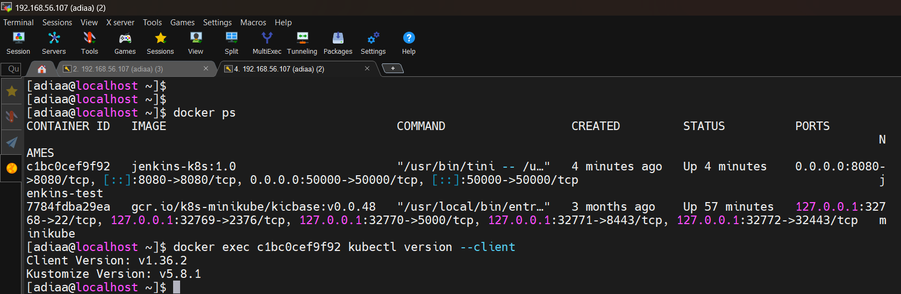
</p>

<p align="center">
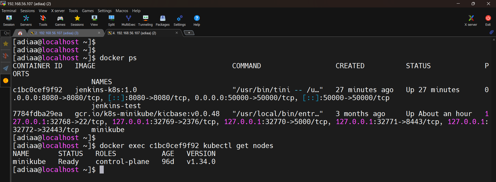
</p>

---

# 🚀 Step 3 — Deploy Jenkins to Kubernetes

Jenkins Controller was deployed as a Kubernetes Deployment.

Persistent storage was attached using a PersistentVolumeClaim.

<p align="center">
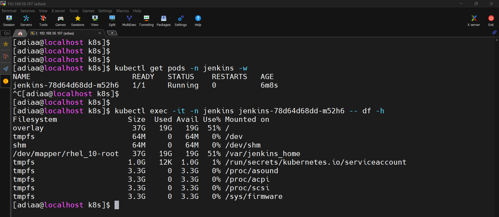
</p>

---

# 🔐 Step 4 — Configure RBAC

A dedicated ServiceAccount was created with the minimum required permissions.

Components implemented:

* ServiceAccount
* ClusterRole
* ClusterRoleBinding

The Jenkins Controller successfully authenticated and communicated with the Kubernetes API.

<p align="center">
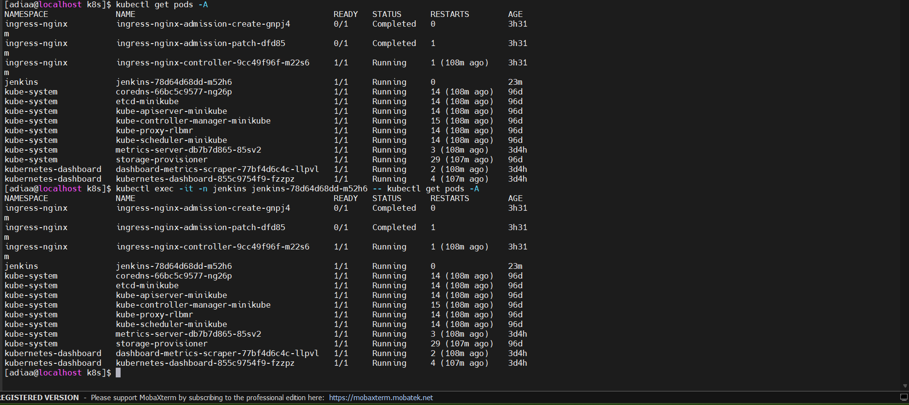
</p>

---

# 🌍 Step 5 — Expose Jenkins Service

Jenkins was exposed using a Kubernetes NodePort Service.

Minikube automatically provided external access.

<p align="center">
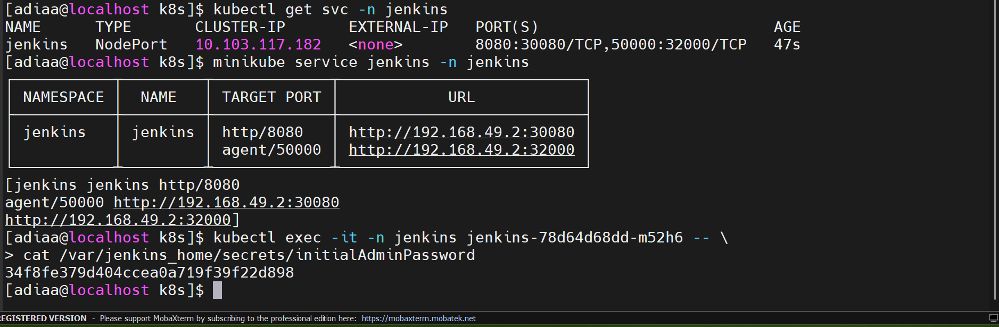
</p>

---

# 🌐 Step 6 — Access Jenkins

Jenkins became available through:

```text
http://192.168.49.2:30080
```

<p align="center">
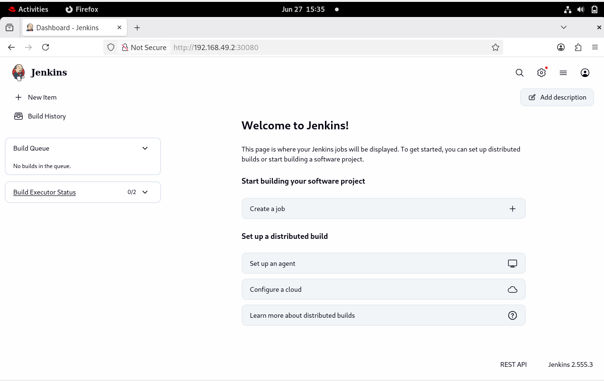
</p>

---

# ☸️ Step 7 — Configure Kubernetes Cloud

Jenkins was configured to use Kubernetes as its Cloud provider.

The Kubernetes Plugin automatically provisions build agents whenever a Pipeline requests one.

Configuration included:

* Kubernetes Cloud
* Pod Template
* Dynamic Agent Label
* Agent Image
* Workspace Volume

<p align="center">
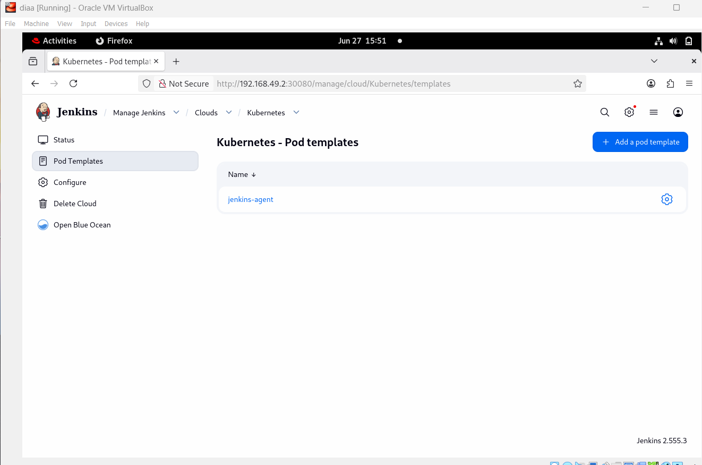
</p>

---

# 🤖 Step 8 — Execute the First Pipeline

The Pipeline requested a Kubernetes Agent.

Instead of using a permanent build machine, Jenkins automatically created a brand-new Pod.

<p align="center">
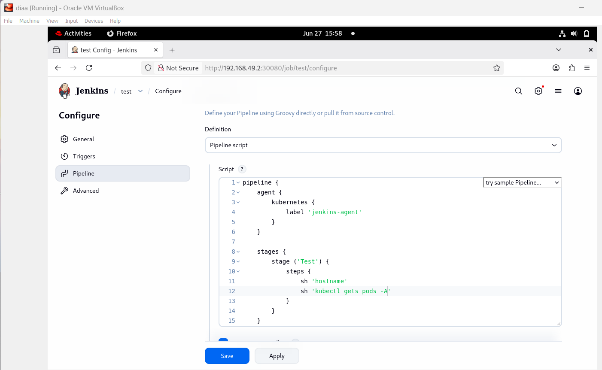
</p>

---

# ⚡ Dynamic Agent Lifecycle

Once the Pipeline started:

* Kubernetes created a temporary Agent Pod.
* Jenkins connected using Jenkins Remoting.
* The build executed remotely.
* The Pod was automatically removed after completion.

## Agent Creation

<p align="center">
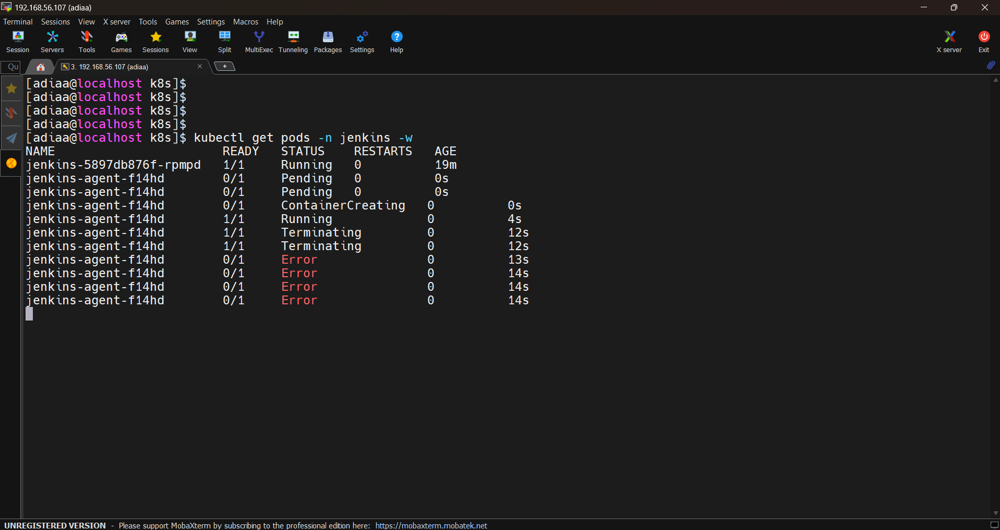
</p>

---

## Pipeline Execution

<p align="center">
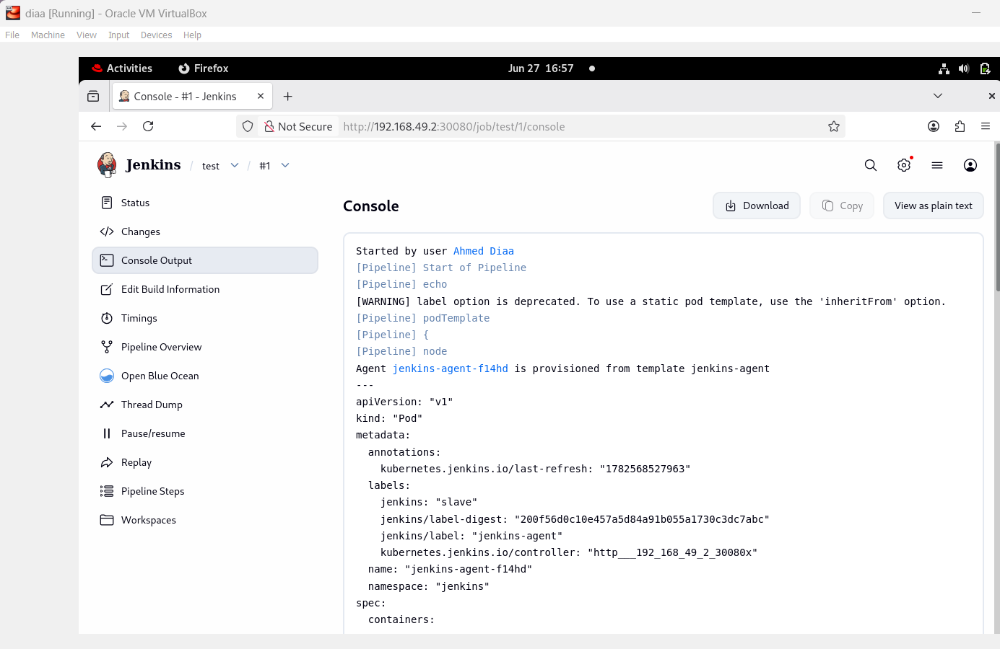
</p>

---

# 🎉 Successful Pipeline Execution

The Pipeline completed successfully.

The Jenkins Controller orchestrated the workflow while the Kubernetes Agent executed the build remotely.

<p align="center">
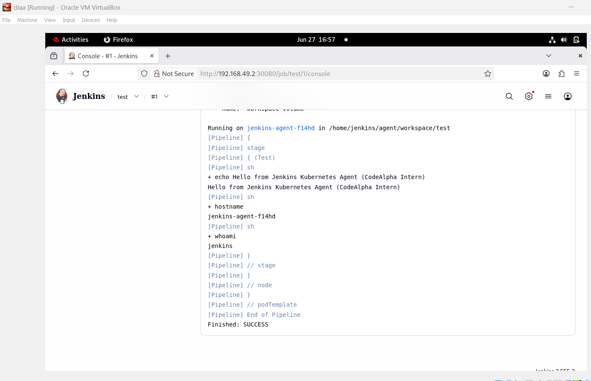
</p>

---

# 🔒 Security Improvements

Compared with traditional Jenkins SSH Agents, this implementation provides:

* Ephemeral Build Agents
* RBAC Authorization
* ServiceAccount Authentication
* Controller / Agent Isolation
* Persistent Controller Storage
* Automatic Agent Cleanup

---

# 📈 What Was Achieved

* Built a custom Jenkins image
* Installed kubectl inside Jenkins
* Deployed Jenkins on Kubernetes
* Configured Persistent Storage
* Implemented RBAC
* Connected Jenkins with Kubernetes
* Provisioned Dynamic Jenkins Agents
* Executed Pipelines remotely
* Automatically destroyed Agent Pods after execution

---

# 💡 Why Kubernetes Dynamic Agents?

Unlike static Jenkins agents, Kubernetes dynamically provisions isolated build environments for every Pipeline execution.

Benefits include:

* Better Security
* Better Scalability
* Lower Resource Consumption
* Automatic Cleanup
* Production-Ready Architecture

---

# ✅ Final Result

This project successfully demonstrates a complete implementation of **Jenkins Remoting using Kubernetes Dynamic Agents**.

Each Pipeline execution provisions a dedicated ephemeral build agent, executes the workload remotely, and automatically cleans up the environment afterward.

The solution closely follows modern cloud-native CI/CD practices used in production Kubernetes environments.

---

# 👨‍💻 Author

**Ahmed Diaa Hassan**

DevOps Engineer

GitHub: https://github.com/Ahmeddiaa128

