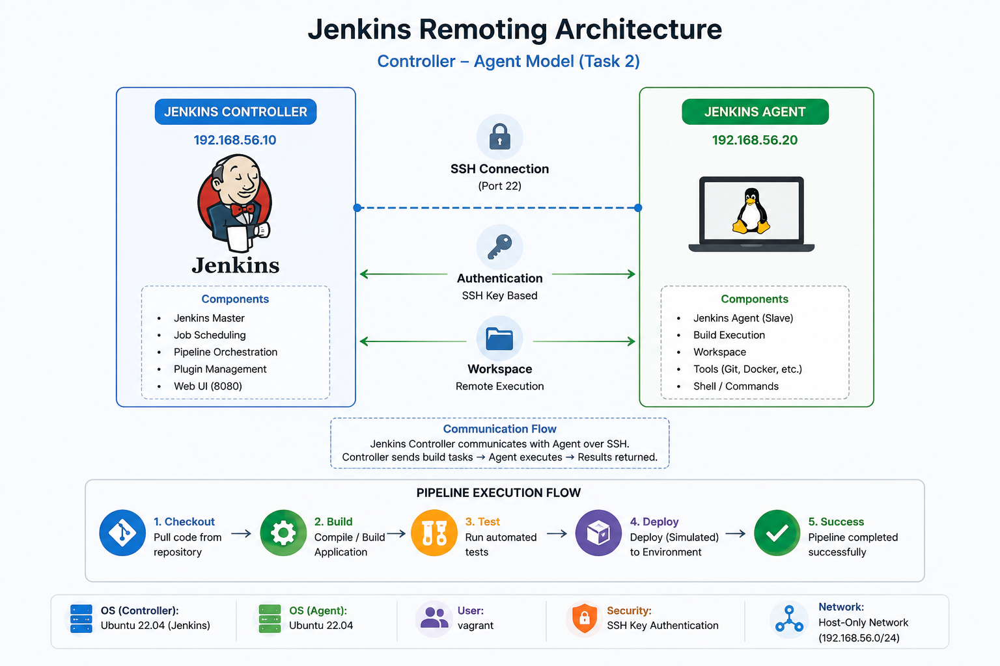
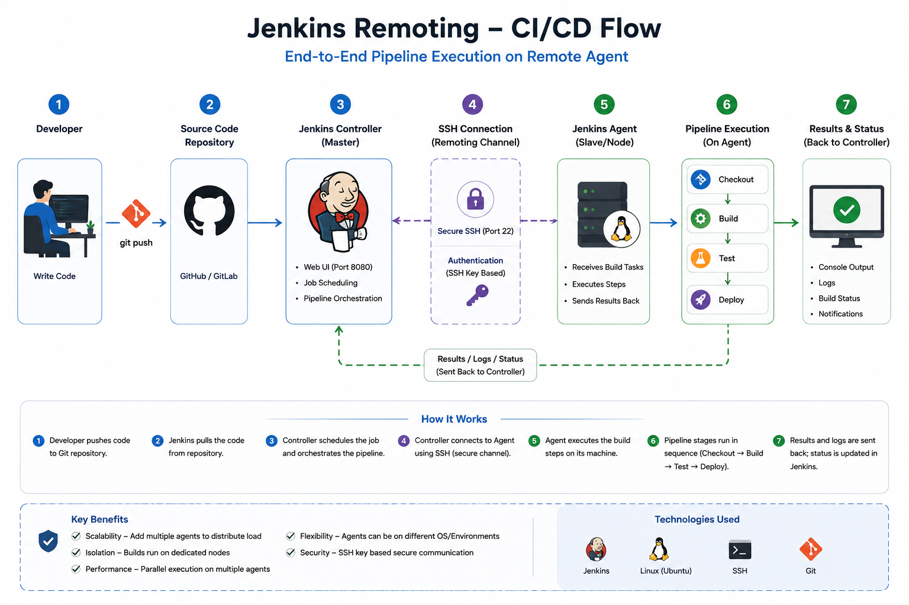
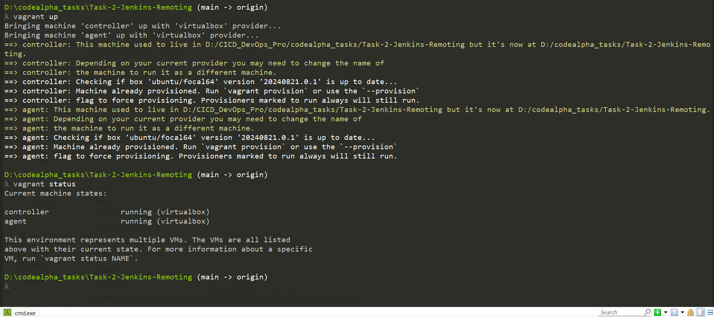
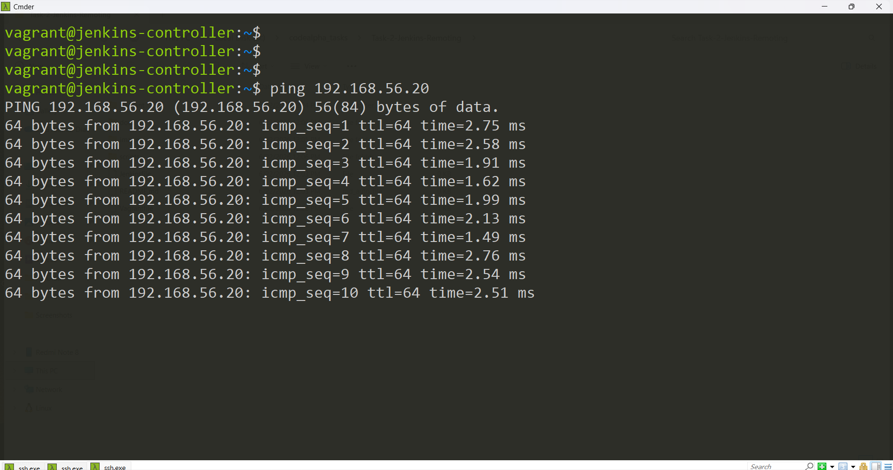
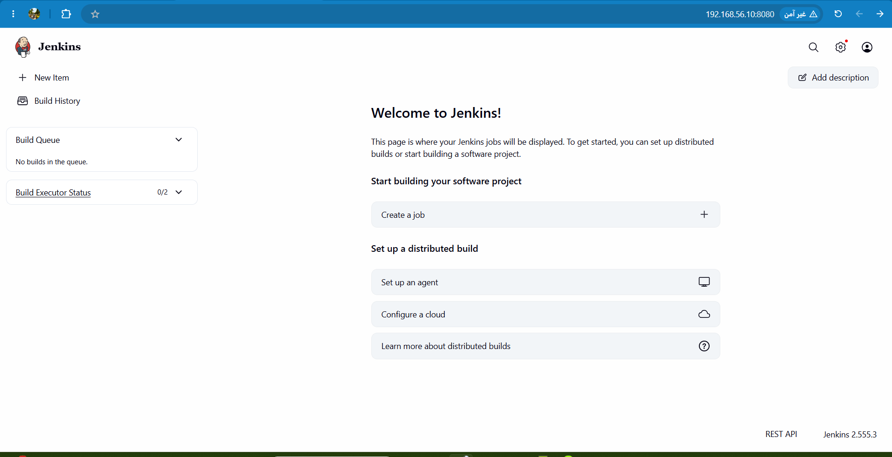
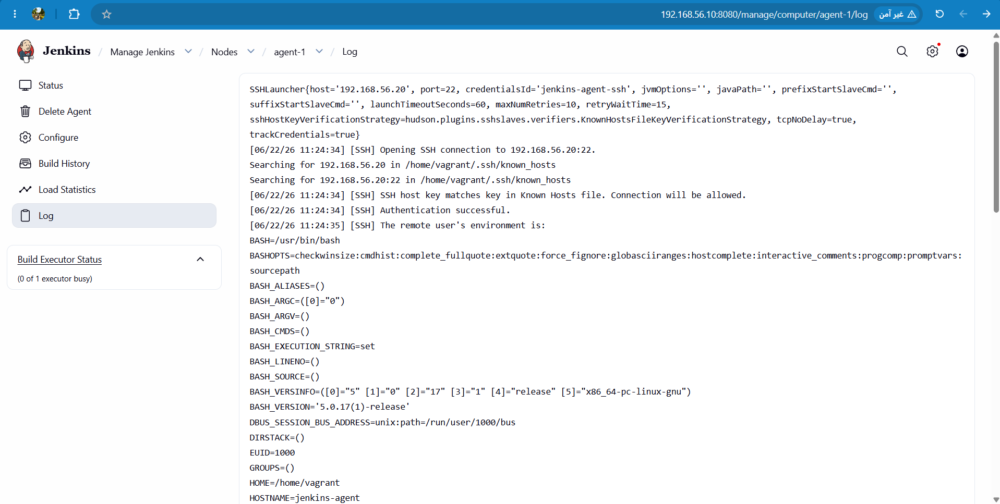
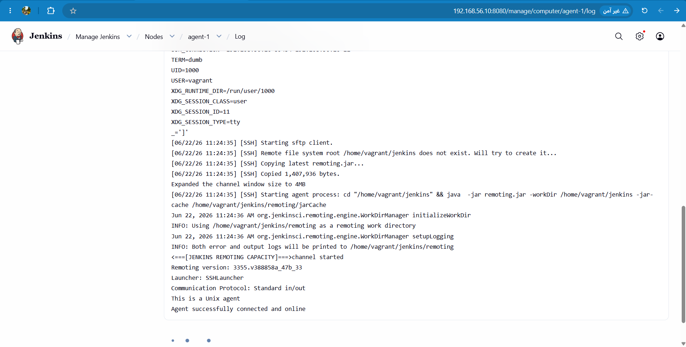
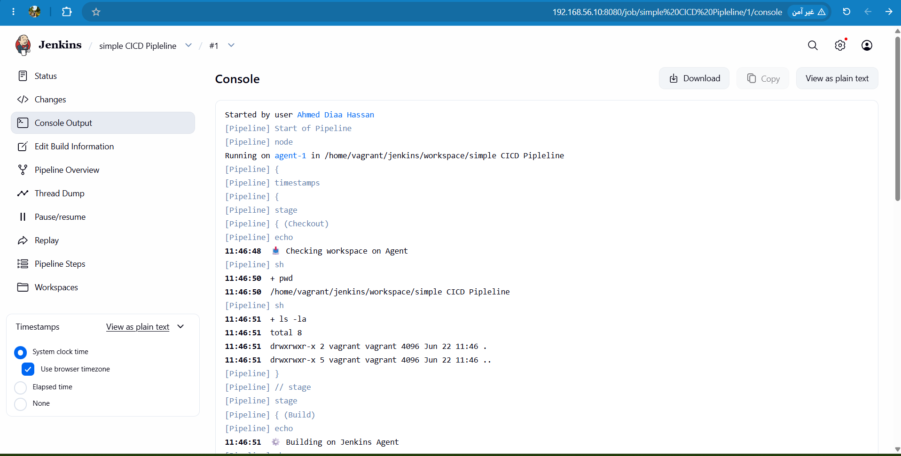
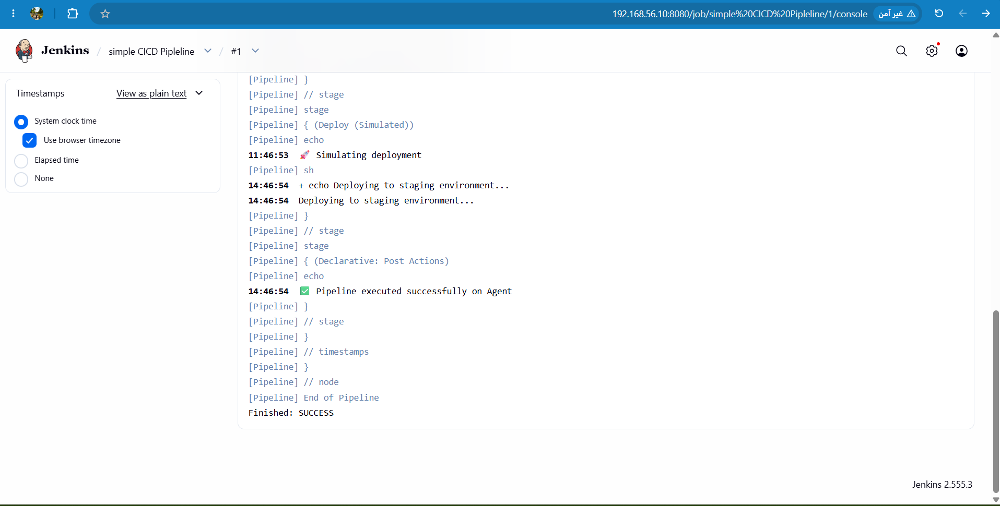

# 🚀 Task 2 - Jenkins Remoting (Controller & Agent using SSH)

> A complete Jenkins Remoting setup using Vagrant, VirtualBox, Ubuntu, and SSH Agent communication.


---

# 📖 Project Overview

This project demonstrates how to build a distributed Jenkins environment where a **Jenkins Controller** manages builds executed on a remote **Jenkins Agent** over SSH.

The entire infrastructure is provisioned locally using:

- Ubuntu Virtual Machines
- Vagrant
- VirtualBox
- Jenkins
- OpenSSH
- Git

This project follows the Jenkins Remoting architecture commonly used in production CI/CD environments.

---

# 📁 Project Structure

```text
vagrant/
│
├── Vagrantfile
├── Jenkinsfile
├── README.md
│
├── scripts/
│   ├── install-controller.sh
│   └── install-agent.sh
│
├── docs/
│   ├── architecture.png
│   ├── diagrams/
│   │   └── jenkins-remoting-flow.png
│   │
│   └── screenshots/
│       ├── 01-vagrant-machines-running.png
│       ├── 02-jenkins-dashboard.png
│       ├── 03-controller-agent-connectivity.png
│       ├── 04-agent-connected-successfully.png
        ├── 05-agent-connected-successfully.png
│       ├── 06-pipeline-stage-checkout.png
│       └── 07-pipeline-stage-success.png
```

---

# 🏗 Architecture

The project consists of two Ubuntu Virtual Machines.

- Jenkins Controller
- Jenkins Agent

The Controller schedules jobs while the Agent executes the build remotely using SSH.

<p align="center">

</p>

---

# 🔄 Jenkins Remoting Flow

The following diagram illustrates how Jenkins communicates with the remote Agent during pipeline execution.

<p align="center">

</p>

---

# ⚙ Technologies Used

| Technology | Purpose |
|------------|---------|
| Jenkins | Automation Server |
| Ubuntu | Operating System |
| Vagrant | VM Provisioning |
| VirtualBox | Virtualization |
| OpenSSH | Secure Agent Communication |
| Git | Version Control |
| Declarative Pipeline | CI/CD Pipeline |

---

# 🖥 Infrastructure

## Jenkins Controller

Responsible for:

- Managing Jenkins
- Scheduling Jobs
- Running Pipelines
- Connecting Agents

---

## Jenkins Agent

Responsible for:

- Executing Pipeline
- Running Shell Commands
- Returning Build Results

---

# 🚀 Provision Virtual Machines

```bash
vagrant up
```

Check VM status

```bash
vagrant status
```

---

# 📷 Running Virtual Machines

Both Ubuntu virtual machines are running successfully.

<p align="center">

</p>

---

# 🌐 Verify Network Connectivity

Ensure the Controller can communicate with the Agent.

```bash
ping 192.168.56.20
```

<p align="center">

</p>

---

# ⚙ Jenkins Dashboard

After installing Jenkins and unlocking it, the Dashboard is ready.

<p align="center">

</p>

---

# 🔑 Configure SSH Agent

The Jenkins Controller connects to the Agent through SSH credentials.

Configuration includes:

- SSH Username
- Private Key
- Agent IP Address
- Launch Method: SSH

---

# ✅ Agent Connected Successfully

The remote Agent is connected and ready for builds.

<p align="center">


</p>

---

# 📝 Jenkins Pipeline

The project includes a Declarative Pipeline.

Pipeline stages:

```text
Checkout
      ↓
Build
      ↓
Test
      ↓
Deploy (Simulation)
```

---

# 📷 Pipeline Execution

## Checkout Stage

Workspace preparation.

<p align="center">

</p>

---

## Build • Test • Deploy

Pipeline executed successfully on the remote Jenkins Agent.

<p align="center">

</p>

---

# 📜 Jenkinsfile

The project uses a Declarative Pipeline that demonstrates:

- Checkout
- Build
- Test
- Simulated Deployment
- Post Actions

---

# 📂 Automation Scripts

The project contains provisioning scripts.

### install-controller.sh

Installs:

- Java
- Jenkins

### install-agent.sh

Installs:

- Java
- Git
- OpenSSH Server

---

# 🎯 Learning Outcomes

✔ Jenkins Controller & Agent Architecture

✔ Jenkins SSH Remoting

✔ Declarative Pipelines

✔ Jenkins Nodes

✔ Vagrant Environment Provisioning

✔ VirtualBox Networking

✔ Linux Administration

✔ SSH Authentication

✔ CI/CD Fundamentals

---

# 📌 Future Improvements

- Docker Integration
- Maven Build
- GitHub Webhooks
- Jenkins Shared Libraries
- Docker Agents
- Kubernetes Agents
- Blue Ocean UI
- Email Notifications

---

# 👨‍💻 Author

**Ahmed Diaa Hassan**

DevOps & Cloud Engineer

- LinkedIn: https://www.linkedin.com/in/ahmed-diaa-hassan-1b7885241

---

## 📌 Notes

This project is part of the **CodeAlpha DevOps Internship** and demonstrates practical skills in:
- Ubuntu Virtual Machines
- Vagrant
- VirtualBox
- Jenkins
- OpenSSH
- Git

