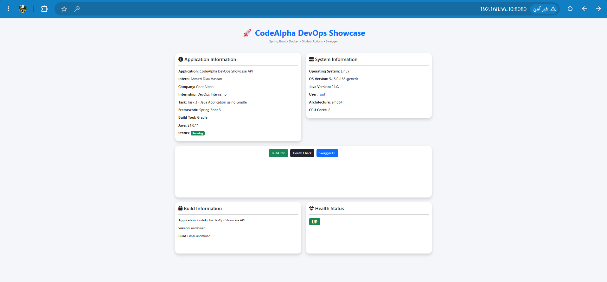
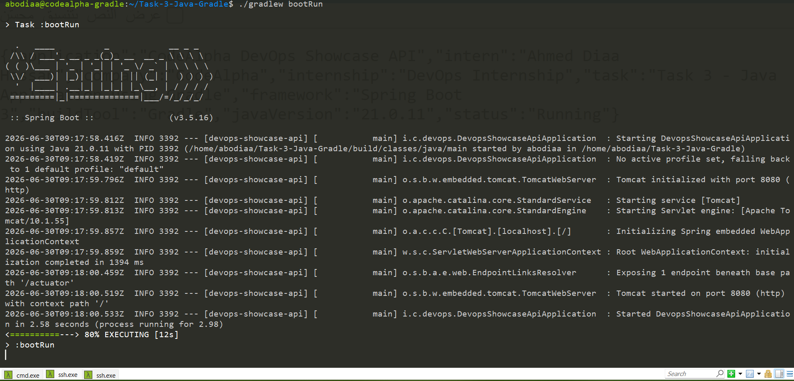
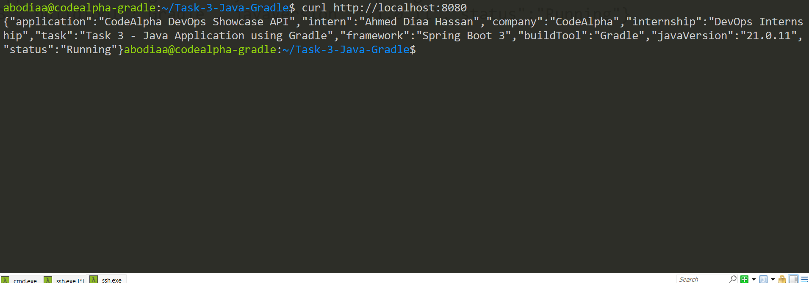
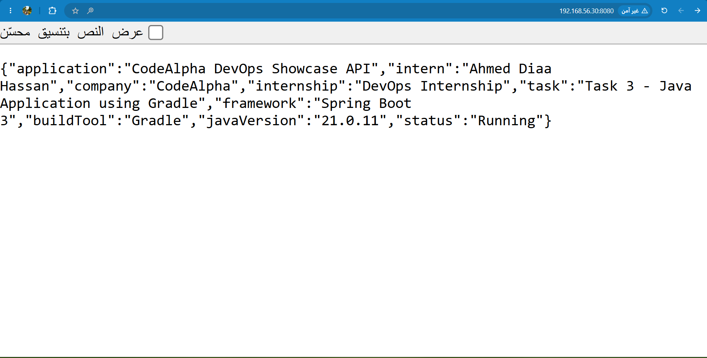
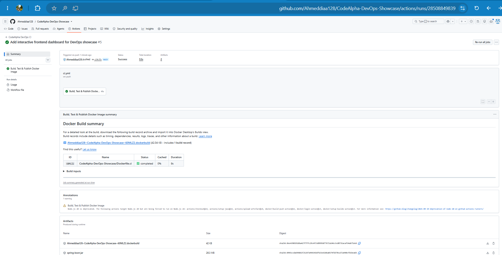
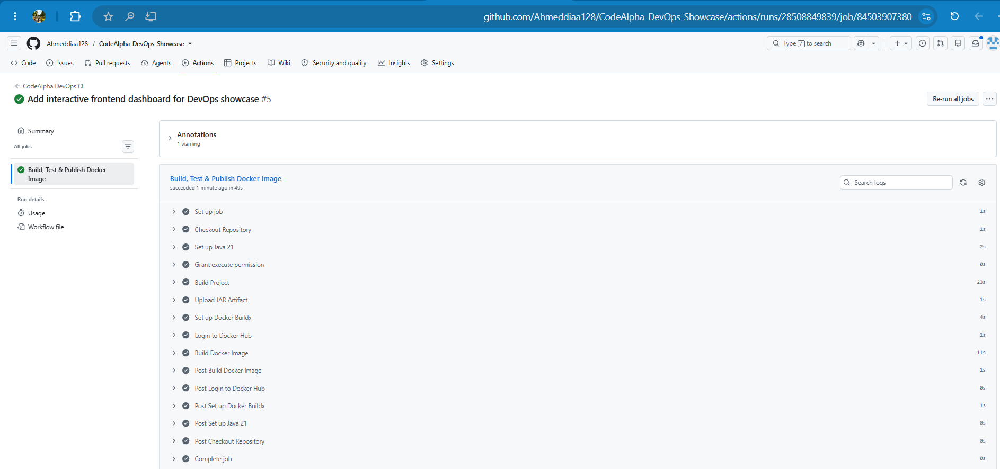
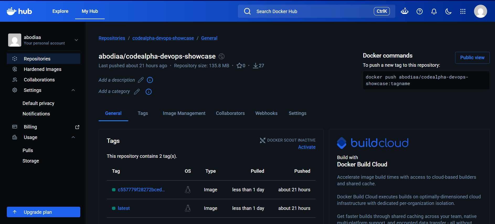
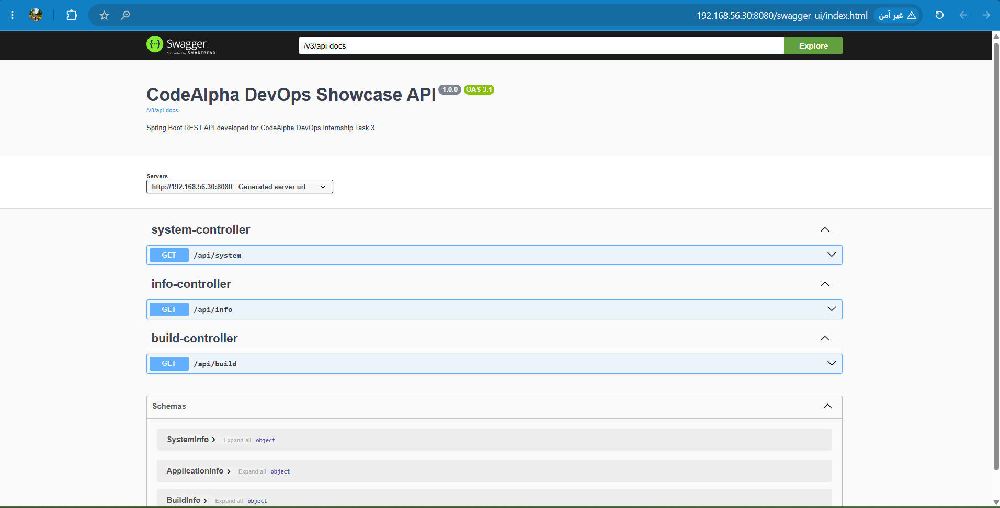

# 🚀 CodeAlpha DevOps Showcase API

<p align="center">



</p>

<p align="center">


</p>

<p align="center">

A production-style Spring Boot REST API developed during the <strong>CodeAlpha DevOps Internship</strong> demonstrating modern DevOps practices including Docker, GitHub Actions CI/CD, Swagger documentation, and an interactive frontend dashboard.

</p>

---

# 📌 Project Overview

This project demonstrates how a modern Java application can be developed, containerized, tested, documented, and automatically published using DevOps best practices.

Instead of building only a REST API, this project follows a complete DevOps workflow including:

* Developing a Spring Boot REST API
* Layered application architecture
* REST endpoints
* Interactive Swagger documentation
* Health monitoring using Spring Boot Actuator
* Docker multi-stage builds
* GitHub Actions CI pipeline
* Docker Hub image publishing
* Interactive frontend dashboard
* Clean project structure
* Production-ready Docker image

The project represents **Task 3** of the **CodeAlpha DevOps Internship**.

---

# 🎯 Project Objectives

The goal of this project is to demonstrate practical DevOps skills by integrating software development with automation and containerization.

Main objectives include:

* Build a REST API using Spring Boot
* Apply layered architecture
* Package the application using Gradle
* Containerize the application using Docker
* Optimize Docker images with Multi-stage builds
* Automate builds using GitHub Actions
* Publish Docker images automatically
* Expose REST APIs with Swagger
* Monitor application health
* Provide a user-friendly frontend dashboard

---

# ✨ Features

## Backend

* Spring Boot 3
* RESTful APIs
* Layered Architecture
* DTO-based responses
* Spring Boot Actuator
* Swagger OpenAPI
* Gradle Build

---

## DevOps

* Docker Multi-stage Build
* GitHub Actions CI Pipeline
* Docker Hub Publishing
* Automated Build
* Automated Tests
* Automated Docker Image Creation

---

## Frontend Dashboard

The application also contains a lightweight frontend dashboard that consumes the backend APIs and displays:

* Application Information
* System Information
* Build Information
* Health Status
* Swagger UI shortcut

---

# 🏗 Architecture

```text
                   +------------------------+
                   |      Web Browser       |
                   +-----------+------------+
                               |
                               |
                     HTTP Requests
                               |
                               v
                 +-------------------------+
                 |  Spring Boot REST API   |
                 +-----------+-------------+
                             |
          +------------------+------------------+
          |                  |                  |
          v                  v                  v
   Home Controller    Info Controller    System Controller
          |                  |                  |
          +------------------+------------------+
                             |
                             v
                  Application Service Layer
                             |
                             v
                         Model Objects

```

---

# 🛠 Technology Stack

| Technology           | Purpose                |
| -------------------- | ---------------------- |
| Java 21              | Programming Language   |
| Spring Boot 3        | Backend Framework      |
| Gradle               | Build Tool             |
| Docker               | Containerization       |
| Docker Multi-stage   | Optimized Images       |
| GitHub Actions       | Continuous Integration |
| Docker Hub           | Image Registry         |
| Swagger / OpenAPI    | API Documentation      |
| Spring Boot Actuator | Monitoring             |
| HTML5                | Frontend               |
| CSS3                 | Styling                |
| JavaScript           | API Integration        |
| Bootstrap 5          | Responsive UI          |
| Font Awesome         | Icons                  |

---

# 📂 Project Structure

```text
Task-3-Java-Gradle
│
├── .github
│   └── workflows
│       └── ci.yml
│
├── docs
│   └── screenshots
│
├── gradle
│
├── src
│   ├── main
│   │   ├── java
│   │   │   └── io/codealpha/devops
│   │   │       ├── config
│   │   │       ├── controller
│   │   │       ├── model
│   │   │       ├── service
│   │   │       └── DevopsShowcaseApiApplication.java
│   │   │
│   │   └── resources
│   │       ├── application.properties
│   │       └── static
│   │           ├── index.html
│   │           ├── style.css
│   │           └── app.js
│   │
│   └── test
│
├── Dockerfile
├── Dockerfile.ci
├── build.gradle
├── settings.gradle
└── README.md
```
---

# 🚀 Getting Started

## Clone the Repository

```bash
git clone https://github.com/Ahmeddiaa128/codealpha_tasks.git

cd Task-3-Java-Gradle
```

---

# ⚙️ Prerequisites

Make sure the following software is installed on your machine.

| Software | Version                |
| -------- | ---------------------- |
| Java     | 21+                    |
| Gradle   | 8+ (or Gradle Wrapper) |
| Docker   | Latest                 |
| Git      | Latest                 |

---

# ▶️ Run Locally

Using Gradle Wrapper:

```bash
./gradlew bootRun
```

or on Windows

```bash
gradlew.bat bootRun
```

The application will start on:

```
http://localhost:8080
```

---

# 📦 Build the Project

```bash
./gradlew clean build
```

The generated JAR file will be available in:

```
build/libs/
```

---

# 🐳 Docker

## Build Docker Image

```bash
docker build -t codealpha-devops-api .
```

---

## Run Docker Container

```bash
docker run -d \
-p 8080:8080 \
--name codealpha-devops \
codealpha-devops-api
```

---

## Stop Container

```bash
docker stop codealpha-devops
```

---

## Remove Container

```bash
docker rm -f codealpha-devops
```

---

# 🏗 Docker Multi-stage Build

The project uses a **Multi-stage Docker Build**.

### Stage 1

* Uses Gradle
* Downloads dependencies
* Compiles the project
* Runs tests
* Builds the executable JAR

### Stage 2

* Uses Eclipse Temurin JRE
* Copies only the generated JAR
* Produces a lightweight runtime image

Benefits:

* Smaller Docker Image
* Faster Deployment
* Better Security
* Cleaner Runtime Environment

---

# 🔄 GitHub Actions CI Pipeline

Every push to the **main** branch automatically triggers the CI pipeline.

Pipeline stages:

```
Source Code
      │
      ▼
Checkout Repository
      │
      ▼
Setup Java 21
      │
      ▼
Gradle Build
      │
      ▼
Run Tests
      │
      ▼
Generate JAR
      │
      ▼
Build Docker Image
      │
      ▼
Login to Docker Hub
      │
      ▼
Push Docker Image
```

The pipeline automatically:

* Checks out the repository
* Installs Java
* Builds the project
* Executes tests
* Creates Docker Image
* Publishes Docker Image to Docker Hub

---

# 📚 API Documentation

Swagger UI is enabled.

Open:

```
http://localhost:8080/swagger-ui/index.html
```

OpenAPI JSON:

```
http://localhost:8080/v3/api-docs
```

Swagger provides:

* Interactive API documentation
* Endpoint testing
* Request/Response schemas

---

# ❤️ Health Monitoring

Spring Boot Actuator is enabled.

Health Endpoint:

```
GET /actuator/health
```

Example Response:

```json
{
  "status": "UP"
}
```

---

# 🌐 REST API Endpoints

## Home

```
GET /
```

Returns the frontend dashboard.

---

## Application Information

```
GET /api/info
```

Returns:

* Application Name
* Intern Name
* Company
* Internship
* Framework
* Build Tool
* Java Version
* Status

---

## System Information

```
GET /api/system
```

Returns:

* Operating System
* OS Version
* Java Version
* Current User
* CPU Architecture
* Processor Count

---

## Build Information

```
GET /api/build
```

Returns build metadata including:

* Build Tool
* Framework
* Docker Support
* CI/CD Integration
* Swagger Support

---

# 📸 Project Screenshots

## 1. Running the Application using Gradle

<p align="center">



</p>

---

## 2. API Response using curl

<p align="center">



</p>

---

## 3. Browser View Before Frontend

<p align="center">



</p>

---

## 4. GitHub Actions Pipeline Running

<p align="center">



</p>

---

## 5. GitHub Actions Pipeline Completed Successfully

<p align="center">



</p>

---

## 6. Docker Image Published Successfully

<p align="center">



</p>

---

## 7. Final Frontend Dashboard

<p align="center">


</p>

---

## 8. Swagger UI

<p align="center">



</p>

---

# 🚀 CI/CD Highlights

This project demonstrates a complete CI/CD workflow using **GitHub Actions**.

### Pipeline Features

* ✅ Automatic build on every push
* ✅ Java 21 environment setup
* ✅ Gradle dependency caching
* ✅ Automated project compilation
* ✅ Automated unit testing
* ✅ Spring Boot JAR packaging
* ✅ Docker image build
* ✅ Multi-stage Docker build
* ✅ Docker Hub authentication
* ✅ Automatic Docker image publishing

---

# 🐳 Docker Hub

The GitHub Actions workflow automatically publishes the application image to Docker Hub.

Example:

```bash
docker pull abodiaa/codealpha-devops-showcase:latest
```

Run the container:

```bash
docker run -d -p 8080:8080 abodiaa/codealpha-devops-showcase:latest
```

---

# 📈 DevOps Practices Demonstrated

This project applies several industry-standard DevOps practices:

* Repository version control using Git
* Continuous Integration with GitHub Actions
* Infrastructure portability using Docker
* Multi-stage Docker builds
* Automated Docker image publishing
* API documentation with Swagger
* Health monitoring using Spring Boot Actuator
* Layered Spring Boot architecture
* Frontend consuming backend REST APIs
* Clean and maintainable project structure

---

# 💡 Skills Demonstrated

## Backend Development

* Java 21
* Spring Boot
* REST API Development
* Dependency Injection
* Layered Architecture

---

## DevOps

* Docker
* Docker Multi-stage Builds
* GitHub Actions
* Docker Hub
* CI/CD Pipelines

---

## API Documentation

* Swagger UI
* OpenAPI 3

---

## Monitoring

* Spring Boot Actuator

---

## Frontend

* HTML5
* CSS3
* Bootstrap 5
* JavaScript
* Fetch API

---

# 🔮 Future Improvements

Potential enhancements for future versions include:

* Kubernetes deployment manifests
* Helm Charts
* Jenkins Pipeline
* Terraform Infrastructure
* NGINX Reverse Proxy
* HTTPS with SSL Certificates
* Prometheus Metrics
* Grafana Dashboard
* Loki Log Aggregation
* Authentication & Authorization
* PostgreSQL Integration
* Redis Caching
* SonarQube Code Quality Analysis
* Trivy Security Scanning
* Multi-environment deployments (Dev / Stage / Production)

---

# 👨‍💻 Author

## Ahmed Diaa Hassan

DevOps Engineer

Faculty of Engineering – Mansoura University

Passionate about:

* DevOps
* Cloud Computing
* Docker
* Kubernetes
* CI/CD
* AWS
* Linux
* Infrastructure Automation

---

# 🔗 Connect With Me

GitHub

```text
https://github.com/Ahmeddiaa128
```

LinkedIn

```text
https://www.linkedin.com/in/ahmed-diaa-hassan/
```

---

# 📜 License

This project was developed as part of the **CodeAlpha DevOps Internship** for educational and portfolio purposes.

Feel free to explore, fork, and learn from the project.

---

# 🙏 Acknowledgments

Special thanks to:

* CodeAlpha
* Spring Boot Team
* Docker
* GitHub Actions
* OpenAPI / Swagger

for providing the technologies used in this project.

---

# ⭐ Support

If you found this project useful:

* ⭐ Star the repository
* 🍴 Fork the repository
* 💬 Share your feedback
* 🚀 Connect with me on LinkedIn

---

<p align="center">

### Thank you for visiting this project ❤️

**Happy Coding! 🚀**

</p>

