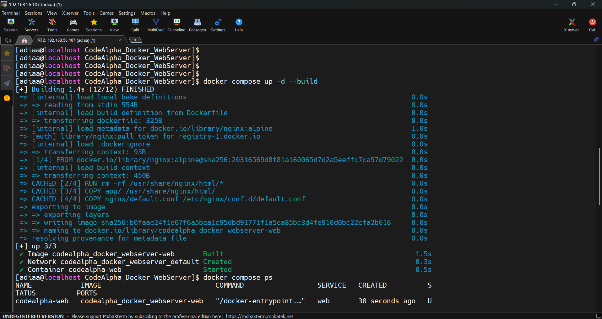
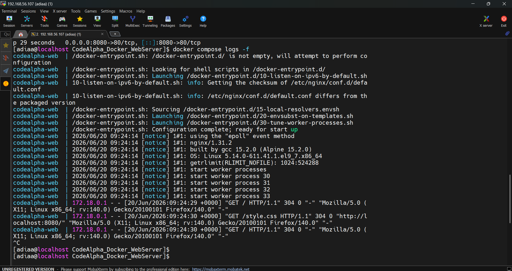
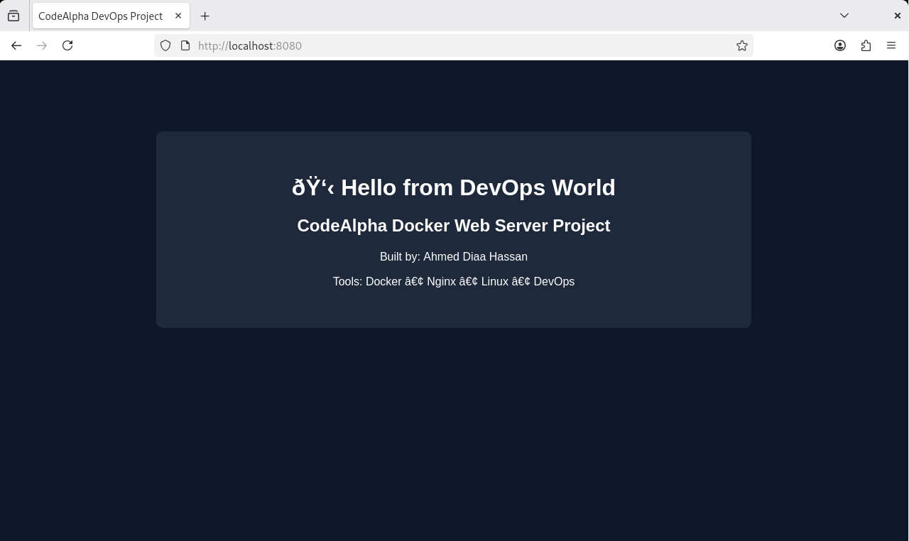

# 🚀 CodeAlpha Docker Web Server Project

## 📌 Overview
This project is a containerized web server built using **Docker** and **Nginx** as part of the CodeAlpha DevOps Internship.

It demonstrates real-world DevOps practices including:
- Containerization
- Infrastructure as Code (Docker Compose)
- Nginx web server configuration
- Image optimization and project structuring

---

## 🎯 Project Objective
The goal of this project is to:
- Build and containerize a static web application
- Serve it using Nginx inside a Docker container
- Manage the application using Docker Compose
- Follow DevOps best practices for project structure and deployment

---

## 🛠️ Technologies Used
- Docker
- Docker Compose
- Nginx
- HTML / CSS
- Linux (RHEL 9)

---

## 📂 Project Structure
```bash
CodeAlpha_Docker_WebServer/
│
├── app/
│   ├── index.html
│   └── style.css
│
├── nginx/
│   └── default.conf
│
├── screenshots/
│   ├── compose-up.png
│   ├── logs.png
│   └── website.png
│
├── Dockerfile
├── docker-compose.yml
├── .dockerignore
└── README.md
```

---

## ⚙️ How It Works

1. Docker builds an image using the `Dockerfile`
2. Nginx serves static files from the `app/` directory
3. Docker Compose manages the container lifecycle
4. The web server is exposed on port **8080**

---

## 🚀 How to Run the Project

### Step 1: Build and Run
```bash
docker compose up -d --build
```
### Step 2: Access the Web App

Open your browser and go to:
```bash
http://localhost:8080
```

---

## 🧪 Useful Docker Commands
```bash
# Build image
docker build -t codealpha-web .

# Run container
docker run -p 8080:80 codealpha-web

# Start with Compose
docker compose up -d

# View running containers
docker ps

# View logs
docker logs -f codealpha-web

# Stop containers
docker compose down
```
---

## 📸 Screenshots

### 🐳 Docker Compose Running


### 📜 Logs Output


### 🌐 Web Application Running


---

## 📈 Key Learnings
- Docker image and container lifecycle
- Writing efficient Dockerfiles
- Nginx configuration for static hosting
- Docker Compose for orchestration
- DevOps workflow basics
- Project structuring for production readiness

---

## 💡 DevOps Concepts Applied
- Containerization
- Infrastructure as Code (IaC)
- Immutable infrastructure
- Service orchestration
- Build reproducibility

---

## 👨‍💻 Author

**Ahmed Diaa Hassan**  
DevOps Engineer (Aspiring)

- LinkedIn: https://www.linkedin.com/in/ahmed-diaa-hassan-1b7885241

---

## 📌 Notes

This project is part of the **CodeAlpha DevOps Internship** and demonstrates practical skills in:
- Docker
- Nginx
- Containerized Web Hosting
- DevOps best practices


